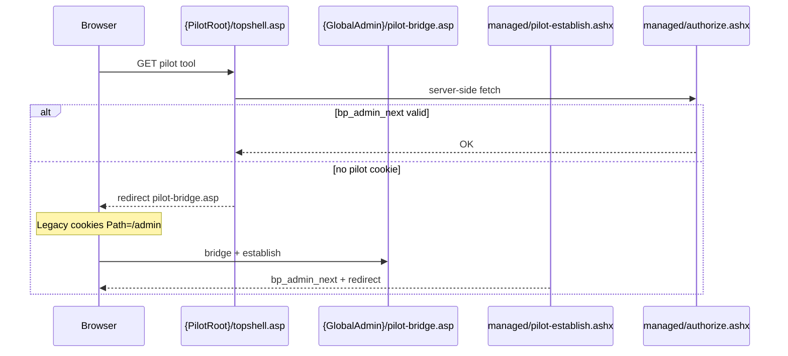

# Managed admin shell — platform reference

Last updated: July 25, 2026

**What this is:** A client-neutral replacement for the legacy global admin
**chrome, login, and tools** — HTML5 shell, VB.NET handlers, managed
applications, and a temporary bridge to unmigrated Classic ASP / Perl tools.

**Start here** for how legacy global admin and the managed admin shell fit together.
Task detail: [`agent-handoff.md`](agent-handoff.md). Git: [`github-repo.md`](github-repo.md).
Legacy cookies: [`legacy-credential-encoder.md`](legacy-credential-encoder.md).

---

## Current direction

The WVBPS deployment was the proving environment. The project is no longer an
unlinked stealth pilot: further work is moving to a global managed-admin folder
so one maintained implementation can replace global Classic ASP and Perl tools.
The exact global physical and URL roots are still to be selected and documented.

Until then:

- this repository is the source of truth;
- WVBPS paths below are historical/example deployment values;
- the existing `GLOBAL_6-next/admin` tree remains read-only;
- do not copy client-specific host, DSN, organization, banner, or secret values
  into the global implementation;
- preserve external contracts by default while replacing implementations in
  .NET;
- add no new Perl, and rebuild substantial Classic ASP changes in .NET.

Migration guidance:

- [`classic-asp-migration-guide.md`](classic-asp-migration-guide.md)
- [`perl-eradication-plan.md`](perl-eradication-plan.md)
- [`security-quality-review-2026-07.md`](security-quality-review-2026-07.md)

## Legacy and managed shells during transition

Every client currently reaches the **global** legacy admin
(`/admin/admin/...`). The managed tree is relocatable through `PilotRootPath`
and currently shares selected ACLs and integrations with legacy while using its
own login and chrome. `Pilot*` identifiers are now historical compatibility
names, not a statement that the product remains in stealth.

| | **Legacy global admin** | **Managed admin shell (pilot)** |
|---|-------------------------|----------------------------------|
| **URL** | `{GlobalAdminRootPath}/...` (usually `/admin/admin`) | `{PilotRootPath}/...` (per client, e.g. `/dev/adminshell`) |
| **Stack** | Classic ASP + Perl CGI + CacheManager COM | Copied Classic ASP tools + HTML/JS + VB.NET handlers |
| **Login** | `login.pl` → `username` / `password` / `authenticated` (`Path=/admin`) | `managed/login.html` → `bp_admin_next` (`Path={PilotRootPath}`) |
| **Session** | Redis `sessionIDadmin` + CacheManager | Same Redis namespace when bridge is active |
| **Chrome** | Global `topshell.asp` | `PilotShell.vb` unified header + left nav |
| **Global source (read-only)** | `GLOBAL_6-next/admin` | This repo (`admin-new`) → sync to client IIS paths |

The original WVBPS rollout was unlinked from the production menu. That is no
longer the product strategy. Compatibility-onboarded ASP tools may keep business
logic unchanged temporarily; any substantial change and every required Perl
capability moves to .NET under the migration guides above.

---

## Request flow (pilot Classic ASP tool)

Paths below use **example** `PilotRootPath=/dev/adminshell`; yours may differ.



1. **`login.html`** → **`login.ashx`** → `bp_admin_next` + legacy cookies (via bridge).
2. Tool includes local **`topshell.asp`** → **`authorize.ashx`** (via **`ssi.inc`**).
3. On `NOSESSION`, redirect to **`pilot-bridge.asp`** under global admin (cookie path fix).
4. **`chrome.ashx`** + tool body; **`session.ashx`** loads nav in browser.

---

## Authentication bridge (bidirectional)

Legacy and pilot cookies use **different `Path` values**. The browser only sends cookies whose path prefix matches the URL.

| Cookie | Typical path | Role |
|--------|--------------|------|
| `bp_admin_next` | `{PilotRootPath}` | Pilot Forms Auth ticket |
| `username`, `password`, `authenticated` | `/admin` | Legacy topshell gate |
| `sessionIDadmin` | `/admin` | Redis session id |

**Pilot → legacy:** `PilotLegacySession.Ensure` on sign-in (Redis `LoginName` + legacy cookies). Needs `PilotMembershipEncryptionKey` in gitignored `web.config.local`.

**Legacy → pilot:** `{PilotRoot}` URLs do not receive `/admin` cookies → **`pilot-bridge.asp`** (under global admin) + **`pilot-establish.ashx`**.

---

## Repo, git, and deployment

### Git (always commit here)

```text
E:\web\repos\admin-new    ← https://github.com/bigpicturesoftware/admin-new
```

Never use a mapped drive as the git root. See [`.cursor/skills/commit-mapped-drive/SKILL.md`](../.cursor/skills/commit-mapped-drive/SKILL.md).

### Per-client IIS sync

After editing the repo, sync to **that client's** mapped paths (examples vary):

| Artifact | Typical IIS location |
|----------|----------------------|
| Pilot ASP + `managed/` | `{client www}/.../adminshell/` (matches `PilotRootPath`) |
| Shared admin-shell VB | Application-root `App_Code/AdminShell/` |
| Code Admin VB | Application-root `App_Code/AdminShell/CodeAdmin/` |
| `RedisService.vb`, `RedisSession.vb` | Application-root `App_Code/` |
| `global-bridge/pilot-bridge.asp` | `{GlobalAdminRootPath}/pilot-bridge.asp` on disk (often global admin folder) |

Application-root `App_Code` is the special source-compilation root. With the
current default compilation configuration, ordinary same-language nested folders
participate in its generated assembly; explicit `codeSubDirectories` entries
would create separate compilation units. Do not create `managed/App_Code`:
only application-root `App_Code` has this behavior.

Global `A:\GLOBAL_6-next\admin` is **read-only** reference. Do not edit except deploying `pilot-bridge.asp` with awareness.

### Relocatable config (`managed/web.config`)

```text
PilotRootPath=...              # e.g. /dev/adminshell
GlobalAdminRootPath=...        # usually /admin/admin
PilotAllowedHost=...           # client dev/prod host
PilotRoutes=...                # pilot path → canonical ACL path
```

All clients share the **same codebase**; hosts, routes, banners, Redis, and encryption keys are **per deployment**.

---

## Configuration and secrets

| File | In git? | Contents |
|------|---------|----------|
| `managed/web.config` | Yes | Routes, allowlist, non-secret app settings |
| `managed/web.config.local.example` | Yes | Template |
| `managed/web.config.local` | **No** | `PilotMembershipEncryptionKey`, other client secrets |

```xml
<appSettings file="web.config.local">
```

---

## Key code (`App_Code/AdminShell/`)

| Area | Files |
|------|--------|
| Auth | `PilotSecurity.vb` |
| Legacy bridge | `PilotLegacySession.vb`, `LegacyMembershipCredentialCodec.vb` |
| Shell | `PilotShell.vb` |
| Access Manager | `AccessManager/AccessManager*.vb` (seven tool-specific files) |
| Code Admin | `CodeAdmin/CodeAdmin*.vb` |
| Redis | `../RedisService.vb`, `../RedisSession.vb` |

---

## Historical proving deployment: WVBPS dev

> WVBPS proved the current implementation. It is no longer the target location
> for further platform development.

| Item | Example (WVBPS dev) |
|------|---------------------|
| Host | `dev.services.wvbps.wv.gov` |
| `PilotRootPath` | `/dev/adminshell` |
| Mapped pilot tree | `A:\wvbps\www\html\dev\adminshell\` |
| Mapped `App_Code` | `A:\wvbps\www\html\App_Code\` |
| Login URL | `https://dev.services.wvbps.wv.gov/dev/adminshell/managed/login.html` |
| ODBC DSN for smoke tests | `wvbps` (client-specific) |

When docs or handoff mention these paths, read them as **this deployment's values**, not platform requirements.

---

## Troubleshooting

| Symptom | Likely cause |
|---------|----------------|
| `NOSESSION` | Missing `bp_admin_next` or bridge not run |
| Legacy `login.pl` after pilot login | Missing `username` cookie / `web.config.local` key |
| Pilot login after legacy only | `pilot-bridge.asp` missing or not deployed under global admin |
| `DENY` | User lacks canonical ACL for route |
| 500 on `login.ashx` | `App_Code` compile error — check application-root source and compilation configuration, then recycle pool |
| Old blue shell | Stale compile — look for `pilot-shell-unified` in view source |

---

## Related docs

| Doc | Use when |
|-----|----------|
| [`agent-handoff.md`](agent-handoff.md) | Boundaries, checklists, rollback |
| [`managed-admin-shell-plan.md`](managed-admin-shell-plan.md) | Original plan and waves |
| [`security-quality-review-2026-07.md`](security-quality-review-2026-07.md) | Security, correctness, performance, and quality findings |
| [`legacy-auth-bridge-hardening-plan.md`](legacy-auth-bridge-hardening-plan.md) | Fixing inbound trust in the cookie bridge |
| [`legacy-credential-encoder.md`](legacy-credential-encoder.md) | Cookie encoding |
| [`classic-asp-migration-guide.md`](classic-asp-migration-guide.md) | ASP compatibility onboarding and .NET rebuilds |
| [`perl-eradication-plan.md`](perl-eradication-plan.md) | Perl contract parity, correction gates, cutover, and deletion |
| [`github-repo.md`](github-repo.md) | Clone, push, secrets |
