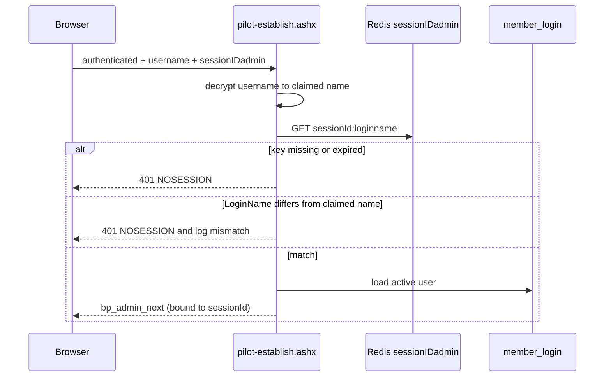

# Legacy Auth Bridge Hardening Plan

Last updated: July 25, 2026

Read with [`admin-shell-platform.md`](admin-shell-platform.md),
[`legacy-credential-encoder.md`](legacy-credential-encoder.md), and
[`agent-handoff.md`](agent-handoff.md).

**Planning assumption:** legacy global admin is being retired. This plan
deliberately avoids any change that requires coordinated Perl edits, and it
optimizes for a clean deletion path rather than a durable two-way contract.

## Problem

The pilot reimplemented the legacy credential cookie faithfully, including its
trust model. `PilotAuth.TryGetCurrentUser` falls back to
`TrySignInFromLegacySession`, which issues a full pilot session on the strength
of two cookies alone:

| Cookie | Value | Verified how |
|--------|-------|--------------|
| `authenticated` | literal `"true"` | string compare |
| `username` | Blowfish-CBC ciphertext of the login name | decrypts without error |

Four defects follow from that.

**1. The cookie is a non-revocable bearer credential.**
`PilotSecurity.vb:480-500` → `PilotLegacySession.vb:113-142`. There is no
password check, no Redis lookup, no binding to `sessionIDadmin`, no timestamp
inside the ciphertext, and no MAC. Whoever holds one valid `username` value can
mint a pilot session as that user indefinitely. Cookie `Path=/admin` scoping does
not contain this — path is a browser convenience, and the handler reads
`Request.Cookies("username")` regardless of which URL delivered it:

```text
GET /dev/adminshell/managed/api/session.ashx
Cookie: authenticated=true; username=<captured ciphertext>
```

Because nothing is stored server-side, nothing can be revoked. Logout, clearing
Redis, and locking the account all leave the credential valid.

**2. Session fixation.** `PilotLegacySession.vb:179-187` adopts whatever
`sessionIDadmin` the browser presents and then writes `LoginName = <victim>`
into Redis under it. A planted session id survives the victim's sign-in.

**3. The two identity planes can diverge.** `PilotLegacySession.vb:64-74`
prefers the request's own `username` cookie over re-encrypting
`user.UserName`, with no check that they agree. A request can carry
`bp_admin_next` for one user and a `username` ciphertext for another.

**4. The ciphertext cannot detect tampering.** `PerlCryptCbcBlowfish` is
unauthenticated CBC with no MAC, and `RemoveSpacePadding`
(`PerlCryptCbcBlowfish.vb:118-129`) performs no validation — every ciphertext
"decrypts successfully." Key and IV derive from a single-pass MD5 EVP KDF
(`:87-98`).

## Design principle

**Inbound trust and outbound compatibility are separable, and only inbound is a
security boundary.**

The pilot must keep *writing* Blowfish cookies so unmigrated Perl and Classic ASP
tools keep working. It does not need to keep *reading* them as proof of identity.
Splitting these two concerns is what makes this fixable without touching global
admin.

The replacement authority is already in place: Redis. Legacy `login.pl` and
CacheManager already write `LoginName` under the `sessionIDadmin` key, and
`RedisService`/`RedisSession` already read that namespace. Promoting Redis from
"something the bridge also writes" to "the thing that decides who you are" gives
us server-side, expiring, revocable session state with **no Perl changes**.

| Concern | Today | Target |
|---------|-------|--------|
| Who the caller is | decrypt `username` cookie | Redis session under `sessionIDadmin` |
| Role of `username` cookie inbound | the credential | a claim, cross-checked against Redis |
| Role of `username` cookie outbound | legacy compatibility | unchanged until sunset |
| Revocation | impossible | delete the Redis key |
| Expiry | browser-side only | Redis TTL |

## Target flow



The decisive change is that a `username` cookie with no live matching Redis
session is worth nothing.

## Phases

### Phase 0 — Contained fixes, no behavior change

No dependency on the phases below; safe to ship on its own.

1. **Mint a fresh session id on sign-in.** In `PilotLegacySession.Ensure`, always
   call `CreateSessionId()` rather than adopting the request's value. Keep the
   adopt-existing behavior in `Refresh` only, where the caller is already
   authenticated. Fixes defect 2.
2. **Stop echoing the client's `username` cookie.** In `Refresh`, always encrypt
   from `user.UserName`. Delete the `existingUsername` branch
   (`PilotLegacySession.vb:64-74`). Fixes defect 3.
3. **Make `SignOut` destroy server-side state.** Call `RedisSession.Abandon` for
   the current `sessionIDadmin` before expiring cookies. Today
   `PilotAuth.SignOut` only clears cookies.
4. **Replace the empty `Catch` blocks in the auth path** (`PilotSecurity.vb:406-410`,
   `:452-455`) with a real log write. Everything below depends on being able to
   see mismatches and failures.

### Phase 1 — Redis becomes the inbound authority

Change `PilotLegacySession.TryGetAuthenticatedLoginName` to require three things
instead of two:

1. `authenticated` is `"true"` (unchanged),
2. `username` decrypts to a non-empty name (unchanged), **and**
3. `sessionIDadmin` names a live Redis session whose `LoginName` matches that
   decrypted name, compared with `PilotPolicy.ConstantTimeEquals`.

Any mismatch fails closed and writes an audit record. `TryResolveLoginNameFromLegacyProof`
gains the session id as a parameter so it stays unit-testable without an
`HttpContext`.

Bind the issued ticket to the session: put `sessionIDadmin` in the
`FormsAuthenticationTicket.UserData` alongside `MemberId`, and have
`TryGetCurrentUser` re-verify that the Redis session still exists on each
request. That closes the revocation gap for `bp_admin_next` itself, not just for
the legacy cookie.

**Behavior change to expect:** a user whose Redis session has expired but whose
cookies persist now gets redirected to the pilot login instead of being silently
re-admitted. That is the point, but it will look like a regression to anyone who
has been relying on the old behavior — call it out in the deploy note.

**Not in scope:** adding a MAC to the cookie. It would require Perl to verify it,
which the sunset assumption rules out. Redis membership gives us the same
property — an attacker-forged ciphertext has no matching session — without
touching global admin.

### Phase 2 — Switch inbound trust off

Add `PilotLegacyInboundTrust` (`redis-verified` | `disabled`, default
`redis-verified`). When `disabled`, `TrySignInFromLegacySession` returns `False`
immediately and legacy users sign in through `managed/login.html`.

This is the readiness gate for sunset: flip it per deployment, confirm nothing
depends on the legacy→pilot direction, then move to Phase 3. Outbound cookie
writing is unaffected by this flag.

### Phase 3 — Sunset

When global admin no longer reads legacy cookies, in this order:

1. Set `PilotLegacyCredentialEncoder=disabled` (the seam already exists —
   `LegacyMembershipCredentialEncoderFactory.vb:46-56`).
2. Delete `PerlCryptCbcBlowfish.vb`, `PerlCryptCbcBlowfishCredentialEncoder.vb`,
   `BlowfishBlockCipher.vb`, and their tests.
3. Delete `PilotLegacySession.vb`, `global-bridge/pilot-bridge.asp`, and
   `managed/pilot-establish.ashx`.
4. Remove the legacy cookie names from `includes/ssi.inc:pilotBuildCookieHeader`.
5. Drop `PilotMembershipEncryptionKey` from `web.config.local` and rotate the
   legacy key, since it will have been in service far longer than intended.

## The `password` cookie

`Ensure` writes the user's live password reversibly encrypted
(`PilotLegacySession.vb:36-43`, `:203-205`). One key disclosure yields plaintext
admin passwords, with reuse risk beyond this application.

This plan does not remove it, because whether legacy topshell actually *requires*
it is unverified — see Open questions. If it turns out to be unused, stop writing
it in Phase 0; if it is required, it disappears at Phase 3 and the key rotation
above becomes mandatory rather than hygienic.

## Configuration

| Key | Values | Default | Phase |
|-----|--------|---------|-------|
| `PilotLegacyInboundTrust` | `redis-verified`, `disabled` | `redis-verified` | 2 |
| `PilotLegacyCredentialEncoder` | `perl-crypt-cbc-blowfish`, `disabled` | existing | 3 |

Both belong in `managed/web.config` (non-secret). No new secrets.

## What must not change

- Outbound cookie format while any unmigrated tool reads it. Phases 0-2 keep
  `Ensure`/`Refresh` writing the same Blowfish values.
- `PilotRoutes` and the canonical ACL model. This plan touches authentication
  only; authorization is unchanged.
- `A:\GLOBAL_6-next\admin`. Nothing here requires a Perl edit.
- Redis key shape. `RedisService.FullKey` casing is what CacheManager expects and
  is already covered by `PilotLegacySessionTests.TestRedisServiceFullKey`.

## Test plan

Existing coverage tests only the rejection branches of
`TryResolveLoginNameFromLegacyProof` (`PilotLegacySessionTests.vb:33-44`). The
accept path — the security-critical one — is untested. Add to that file:

- valid ciphertext + live matching Redis session → accepted;
- valid ciphertext + **no** Redis session → rejected;
- valid ciphertext + Redis session naming a **different** user → rejected;
- `authenticated` absent but session live → rejected;
- `Ensure` mints a new session id even when the request supplies one;
- `Refresh` emits a ciphertext of the authenticated user, not the request's value.

The Redis dependency needs a seam. Introduce a minimal
`ILegacySessionStore` (`TryGetLoginName(sessionId, ByRef name)`) with the
`RedisService` implementation and a dictionary fake, mirroring how
`ILegacyMembershipCredentialEncoder` is already structured. Keep it in
`App_Code/AdminShell/` beside the other shared types.

Remote verification (IIS, per
[`.cursor/rules/browser-e2e.mdc`](../.cursor/rules/browser-e2e.mdc)):

1. Pilot sign-in still lands on Views, and `ajax.asp?action=session` still
   returns 200 — the outbound bridge is intact.
2. Legacy `login.pl` first, then a pilot tool → still admitted (Phase 1).
3. Delete the Redis key, retry with the same cookies → 401, redirect to pilot
   login.
4. Replay a captured `username` cookie from another browser with no
   `sessionIDadmin` → 401.
5. `PilotLegacyInboundTrust=disabled` → legacy-only users get the pilot login
   page (Phase 2).

## Rollback

Phase 0 is behavior-preserving; roll back by reverting the commit. Phase 1 is the
risky one — if legacy→pilot handoff breaks in a way that blocks staff, revert
`PilotLegacySession.vb` and `PilotSecurity.vb` and recycle the app pool. Phase 2
is a config flip and needs no code rollback. Keep Phases 0, 1, and 2 as separate
commits so they can be reverted independently.

## Open questions

1. Does legacy topshell actually require the `password` cookie, or only
   `username` + `authenticated`? Determines whether Phase 0 can stop writing it.
   Answer from `A:\GLOBAL_6-next\admin` topshell and `login.pl` — read-only.
2. Does `login.pl` always populate Redis `LoginName`, or are there paths that set
   cookies without a session? Phase 1 assumes it always does; a gap there would
   lock those users out.
3. Is `PilotMembershipEncryptionKey` shared across clients? If so, one
   compromised deployment exposes all of them, and rotation moves from Phase 3 to
   immediate.
4. What is the actual sunset date? If it is near, Phase 2 could be skipped and
   Phase 1 could go straight to `disabled`.

## Related issues, tracked separately

Found in the same review, outside this plan's scope but worth scheduling — all
three are small and contained:

- `includes/ssi.inc:47` disables **all** TLS certificate validation
  (`setOption 2, 13056`) on the server-side call that carries session cookies and
  whose `OK|username` response `topshell.asp:38-40` trusts for identity.
- `global-bridge/pilot-bridge.asp:10,40` redirects to an unvalidated `returnUrl`
  (open redirect on an authenticated admin host). `PilotPolicy.IsSafeReturnUrl`
  already exists; the bridge just cannot reach it from VBScript.
- The login throttle counts against `context.Session`
  (`managed/login.ashx:98,175-190`), so dropping the session cookie resets it to
  zero on every attempt.

## Status

- [ ] Phase 0 — session id minting, refresh echo, `SignOut` teardown, auth logging
- [ ] Phase 1 — Redis-verified inbound trust + ticket/session binding
- [ ] Phase 2 — `PilotLegacyInboundTrust=disabled` readiness gate
- [ ] Phase 3 — delete the bridge and rotate the legacy key
- [ ] Open questions 1-4 answered
